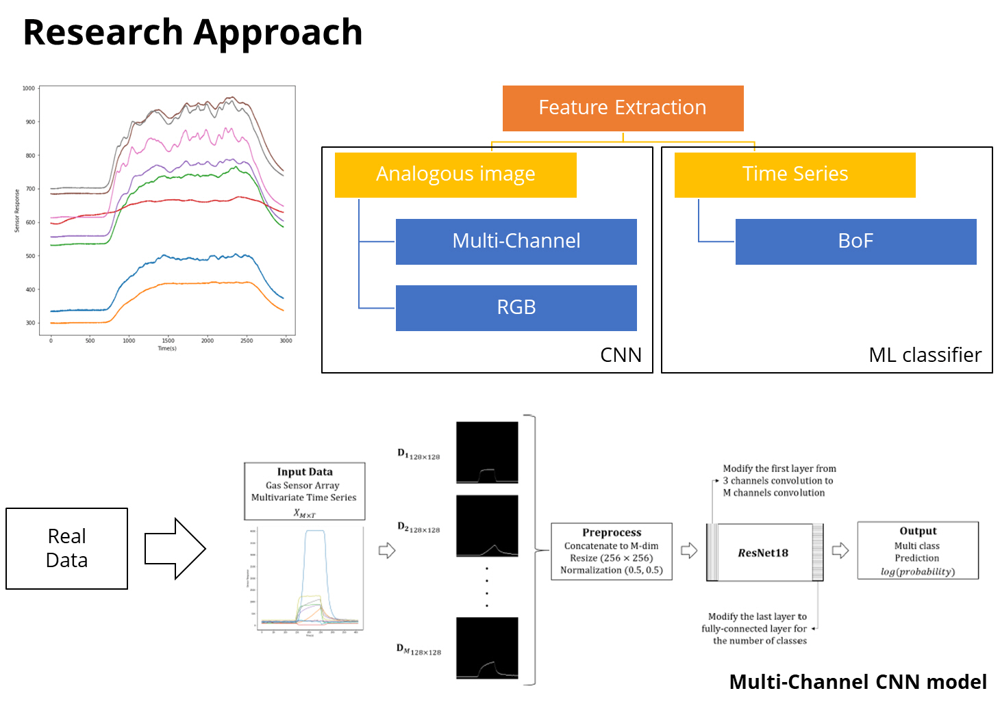
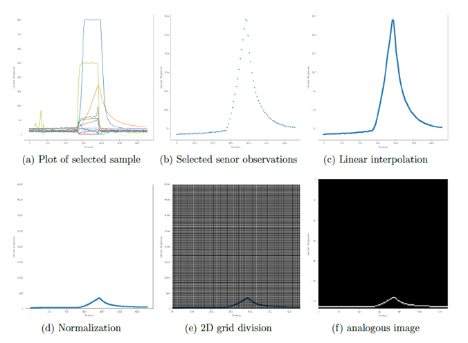
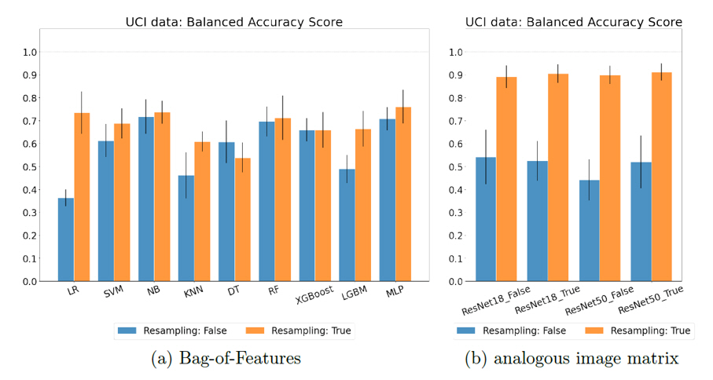

# [Multichannel Convolution Neural Network for Gas Mixture Classification](https://yongkyung-oh.github.io/Multichannel-CNN/)

(Working paper at ICDM 2021 Ph.D. forum) [Oh, Y. and Kim, S., "Multi-channel Convolution Neural Network for Gas Mixture Classification," 2021 International Conference on Data Mining Workshops (ICDMW), 2021, pp. 1094-1095](https://ieeexplore.ieee.org/abstract/document/9679920)

(Full paper publication) [Oh, Y., Lim, C., Lee, J., Kim, S., & Kim, S. (2022). Multichannel convolution neural network for gas mixture classification. Annals of Operations Research, 1-35.](https://link.springer.com/article/10.1007/s10479-022-04715-2)

Corresponding author: SungIl Kim (sungil.kim@unist.ac.kr)

## Abstract
Concomitant with people beginning to understand their legal rights or entitlement to complain, complaints of offensive odors and smell pollution have increased significantly. Consequently, monitoring gases and identifying their types and causes in real time has become a critical issue in the modern world. In particular, toxic gases that may be generated at industrial sites or odors in daily life consist of hybrid gases made up of various chemicals. Understanding the types and characteristics of these mixed gases is an important issue in many areas. However, mixed gas classification is challenging because the gas sensor arrays for mixed gases must process complex nonlinear high-dimensional data. In addition, obtaining sufficient training data is expensive. To overcome these challenges, this paper proposes a novel method for mixed gas classification based on analogous image representations with multiple sensor-specific channels and a convolutional neural network (CNN) classifier. The proposed method maps a gas sensor array into a multichannel image with data augmentation, and then utilizes a CNN for feature extraction from such images. The proposed method was validated using public mixture gas data from the UCI machine learning repository and real laboratory experiments. The experimental results indicate that it outperforms the existing classification approaches in terms of the balanced accuracy and weighted F1 scores. Additionally, we evaluated the performance of the proposed method in various experimental settings in terms of data representation, data augmentation, and parameter initialization, so that practitioners can easily apply it to artificial olfactory systems.

## Methodology
### Overview

### Input adaptation

### Experiment reuslts 

